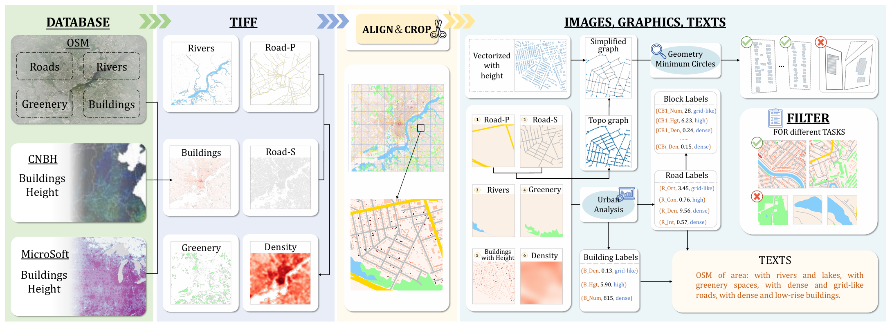

# RoBus_Dataset
* Official repository for ArXiv Preprint paper "RoBus: A Multimodal Dataset for Controllable Road Networks and Building Layouts Generation". Full code will be released after acceptance.

## Introduction
Automated 3D city generation, focusing on road networks and building layouts, is in high demand for applications in urban design, multimedia games and autonomous driving simulations.
The surge in generative AI models facilitates the design of city layouts in recent years. 
However, the lack of high-quality datasets and benchmarks hinders the progress of these data-driven methods in generating road networks and building layouts.
Furthermore, few studies consider urban characteristics, which are generally analyzed using graphics and are crucial for practical applications, to control the generative process.
To alleviate these problems, we introduce a multimodal dataset with accompanying evaluation metrics for controllable generation of \textbf{Ro}ad networks and \textbf{Bu}ilding layout\textbf{s} (\textbf{RoBus}), which is the first and largest open-source dataset in city generation so far. 
RoBus dataset is formatted as images, graphics and texts, with $72,400$ paired samples that cover around $80,000 \, km^2$ globally.
We analyze the RoBus dataset statistically and validate the effectiveness against existing road networks and building layouts generation methods. 
Additionally, we design new baselines that incorporate urban characteristics, such as road orientation and building density, in the process of generating road networks and building layouts using the RoBus dataset, enhancing the practicality of automated urban design.


## Dataset Generation Pipeline


## Visualization of data samples
* visualize tiff images
```shell
python read_tiff.py
```